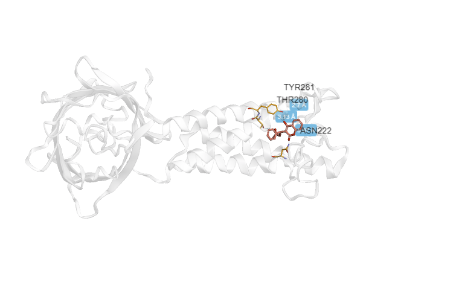

# Варфарин
## Действующее вещество
Почти во всех таблетках, которые я посмотрел 

## Область применения
Применяется пациентам с повышенной склонностью тромбоза, в качестве первичной профилактики лицам, имоющим вероятность тромбоза, а так же в качестве вторичной профилактики лицам, у которых уже образовался тромб.

## Молекулярный механизм действия
Всасывается в кишечнике, связывается с белками плазмы, метоболизируется в печени. Различные изомеры варфарина преобразуются в печени в 2 метаболита, один из которых левый, а второй правый (что бы это не значило:). Преобразуется в ферменты, после чего блокирует в печени производство К-зависимых факторов крови, а так же снижает их количество в плазме, чем и вызывает замедление свертывания крови.

# Docking
Располагается в подпапке Docking данной директории

# Изображения
<figure>
  <figcaption>Трехмерная структура подготовленного таргета</figcaption>
  
</figure>

<figure>
  <figcaption>Трехмерная структура исходного лиганда</figcaption>
  
</figure>

<figure>
  <figcaption>Полученный бокс</figcaption>
  
</figure>

<figure>
  <figcaption>Докинг</figcaption>
  
</figure>
